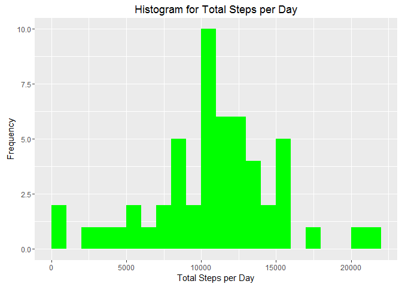
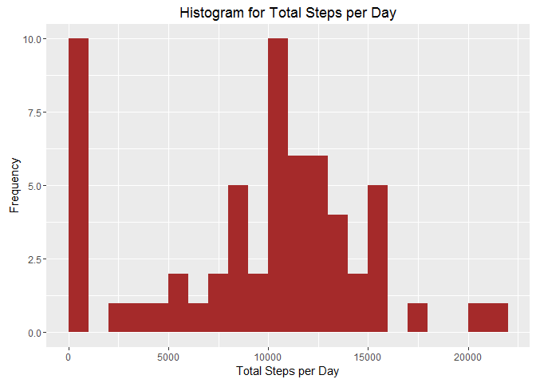
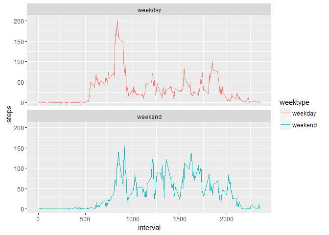

# Reproducible Research: Peer Assessment 1


## Loading and preprocessing the data
  
  
###    1. Load the data (i.e. read.csv())

```r
# Get data 
if(!file.exists("http://d396qusza40orc.cloudfront.net/repdata%2Fdata%2Factivity.zip")) {
    temp <- tempfile()
    download.file("http://d396qusza40orc.cloudfront.net/repdata%2Fdata%2Factivity.zip",temp)
    unzip(temp)
    unlink(temp)
}

# Load data
activityDF <- read.csv("activity.csv", header = TRUE, sep = ",")
head(activityDF)
```

```
##   steps       date interval
## 1    NA 2012-10-01        0
## 2    NA 2012-10-01        5
## 3    NA 2012-10-01       10
## 4    NA 2012-10-01       15
## 5    NA 2012-10-01       20
## 6    NA 2012-10-01       25
```

```r
summary(activityDF)
```

```
##      steps                date          interval     
##  Min.   :  0.00   2012-10-01:  288   Min.   :   0.0  
##  1st Qu.:  0.00   2012-10-02:  288   1st Qu.: 588.8  
##  Median :  0.00   2012-10-03:  288   Median :1177.5  
##  Mean   : 37.38   2012-10-04:  288   Mean   :1177.5  
##  3rd Qu.: 12.00   2012-10-05:  288   3rd Qu.:1766.2  
##  Max.   :806.00   2012-10-06:  288   Max.   :2355.0  
##  NA's   :2304     (Other)   :15840
```

```r
str(activityDF)
```

```
## 'data.frame':	17568 obs. of  3 variables:
##  $ steps   : int  NA NA NA NA NA NA NA NA NA NA ...
##  $ date    : Factor w/ 61 levels "2012-10-01","2012-10-02",..: 1 1 1 1 1 1 1 1 1 1 ...
##  $ interval: int  0 5 10 15 20 25 30 35 40 45 ...
```
   
  
###    2. Process/transform the data (if necessary) into a format suitable for your analysis  
  

```r
# Clean data
library(lubridate)
activityDF$date <- ymd(activityDF$date)
```
  
  


## What is mean total number of steps taken per day?

 
  
###    1. Calculate the total number of steps taken per day  
  
The total number of steps per day is as follows:

```r
library(dplyr)
```

```
## 
## Attaching package: 'dplyr'
```

```
## The following objects are masked from 'package:lubridate':
## 
##     intersect, setdiff, union
```

```
## The following objects are masked from 'package:stats':
## 
##     filter, lag
```

```
## The following objects are masked from 'package:base':
## 
##     intersect, setdiff, setequal, union
```

```r
stepsDF <- activityDF %>%
    filter(!is.na(steps)) %>%
    group_by(date) %>%
    summarize(steps = sum(steps)) %>%
    print
```

```
## Source: local data frame [53 x 2]
## 
##          date steps
##        (time) (int)
## 1  2012-10-02   126
## 2  2012-10-03 11352
## 3  2012-10-04 12116
## 4  2012-10-05 13294
## 5  2012-10-06 15420
## 6  2012-10-07 11015
## 7  2012-10-09 12811
## 8  2012-10-10  9900
## 9  2012-10-11 10304
## 10 2012-10-12 17382
## ..        ...   ...
```
  
  
###    2. If you do not understand the difference between a histogram and a barplot, research the difference between them. Make a histogram of the total number of steps taken each day  

```r
library(ggplot2)

ggplot(stepsDF, aes(x = steps)) +
    geom_histogram(breaks=seq(0, 22250, by = 1000), fill = "green") +
    labs(title = "Histogram for Total Steps per Day", x = "Total Steps per Day", y = "Frequency")
```


  
  
###    3. Calculate and report the mean and median of the total number of steps taken per day  

```r
stepsSum <- sum(stepsDF$steps, na.rm = TRUE)
stepsMean <- mean(stepsDF$steps, na.rm = TRUE)
stepsMedian <- median(stepsDF$steps, na.rm = TRUE)

stepsSum
```

```
## [1] 570608
```

```r
stepsMean
```

```
## [1] 10766.19
```

```r
stepsMedian
```

```
## [1] 10765
```


## What is the average daily activity pattern?


  
    
### 1. Make a time series plot (i.e. type = "l") of the 5-minute interval (x-axis) and the average number of steps taken, averaged across all days (y-axis)  


```r
# Average steps taken per 5 min interval
stepsTS <- activityDF %>%
    filter(!is.na(steps)) %>%
    group_by(interval) %>%
    summarize(steps = mean(steps))
```


```r
# Plot average steps taken per 5 min interval
ggplot(stepsTS, aes(x=interval, y=steps)) +
    geom_line(color = "blue")
```


  
  
  
### 2. Which 5-minute interval, on average across all the days in the dataset, contains the maximum number of steps?  

The interval with the maximum amount of steps is

```r
# Interval with max amount of steps
stepsTS[which.max(stepsTS$steps),]
```

```
## Source: local data frame [1 x 2]
## 
##   interval    steps
##      (int)    (dbl)
## 1      835 206.1698
```
  
  
  
## Imputing missing values


  
### 1. Calculate and report the total number of missing values in the dataset (i.e. the total number of rows with NAs)  
  
The total number of NAs is:

```r
# Total rows with NAs
sum(is.na(activityDF$steps))
```

```
## [1] 2304
```
  
  
  
### 2. Devise a strategy for filling in all of the missing values in the dataset. The strategy does not need to be sophisticated. For example, you could use the mean/median for that day, or the mean for that 5-minute interval, etc.  
The median for a specific day will be used in case there's NAs for that day.
  
    
### 3. Create a new dataset that is equal to the original dataset but with the missing data filled in.  


```r
# Create a new dataframe 
activityClean <- activityDF

# Replace NAs
activityClean <- activityClean %>%
    mutate(steps = ifelse(is.na(steps),median(steps, na.rm = TRUE), steps))
```
  
  
  
### 4. Make a histogram of the total number of steps taken each day and Calculate and report the mean and median total number of steps taken per day. Do these values differ from the estimates from the first part of the assignment? What is the impact of imputing missing data on the estimates of the total daily number of steps?  


```r
# Total number of steps taken per day

stepsClean <- activityClean %>%
    filter(!is.na(steps)) %>%
    group_by(date) %>%
    summarize(steps = sum(steps)) %>%
    print
```

```
## Source: local data frame [61 x 2]
## 
##          date steps
##        (time) (dbl)
## 1  2012-10-01     0
## 2  2012-10-02   126
## 3  2012-10-03 11352
## 4  2012-10-04 12116
## 5  2012-10-05 13294
## 6  2012-10-06 15420
## 7  2012-10-07 11015
## 8  2012-10-08     0
## 9  2012-10-09 12811
## 10 2012-10-10  9900
## ..        ...   ...
```

```r
# Histogram total number steps per day

ggplot(stepsClean, aes(x = steps)) +
    geom_histogram(breaks=seq(0, 22250, by = 1000), fill = "brown") +
    labs(title = "Histogram for Total Steps per Day", x = "Total Steps per Day", y = "Frequency")
```



```r
# Mean, mean and total number steps taken per day

stepsSumCl <- sum(stepsClean$steps, na.rm = TRUE)
stepsMeanCl <- mean(stepsClean$steps, na.rm = TRUE)
stepsMedianCl <- median(stepsClean$steps, na.rm = TRUE)

stepsSumCl
```

```
## [1] 570608
```

```r
stepsMeanCl
```

```
## [1] 9354.23
```

```r
stepsMedianCl
```

```
## [1] 10395
```
  
  
Replacing the NA values with the median value for that day has changed the values for the mean and median, these two values are now more far apart than initially.  
  
  
## Are there differences in activity patterns between weekdays and weekends?


For this part the weekdays() function may be of some help here. Use the dataset with the filled-in missing values for this part.  
  
### 1. Create a new factor variable in the dataset with two levels - "weekday" and "weekend" indicating whether a given date is a weekday or weekend day.  
  

```r
activityClean <- mutate(activityClean, weektype = ifelse(weekdays(activityClean$date) == "Saturday" | weekdays(activityClean$date) == "Sunday", "weekend", "weekday"))
activityClean$weektype <- as.factor(activityClean$weektype)
head(activityClean)
```

```
##   steps       date interval weektype
## 1     0 2012-10-01        0  weekday
## 2     0 2012-10-01        5  weekday
## 3     0 2012-10-01       10  weekday
## 4     0 2012-10-01       15  weekday
## 5     0 2012-10-01       20  weekday
## 6     0 2012-10-01       25  weekday
```
  
  
### 2. Make a panel plot containing a time series plot (i.e. type = "l") of the 5-minute interval (x-axis) and the average number of steps taken, averaged across all weekday days or weekend days (y-axis). See the README file in the GitHub repository to see an example of what this plot should look like using simulated data.

```r
stepsTSClean <- activityClean %>%
    group_by(interval, weektype) %>%
    summarise(steps = mean(steps))
```

```r
ggplot(stepsTSClean, aes(x=interval, y=steps, color = weektype)) +
    geom_line() +
    facet_wrap(~weektype, ncol = 1, nrow=2)
```



During the weekdays the number of steps starts earlier than during the weekends however, during the weekends there are more number of steps throughout the day than during the weekdays.
